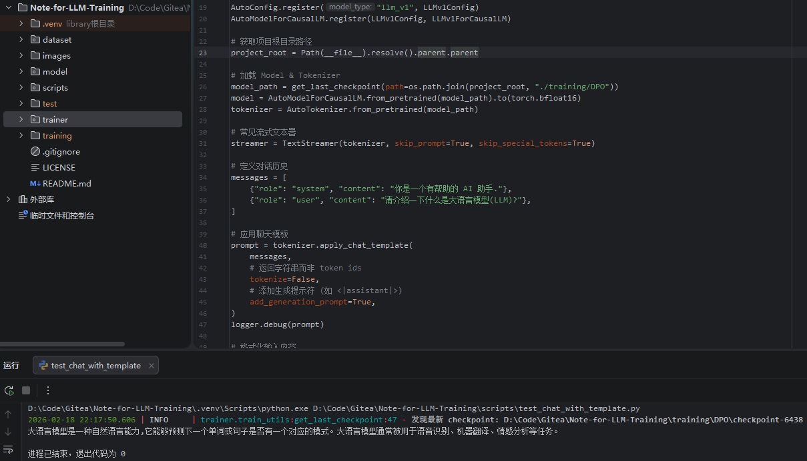
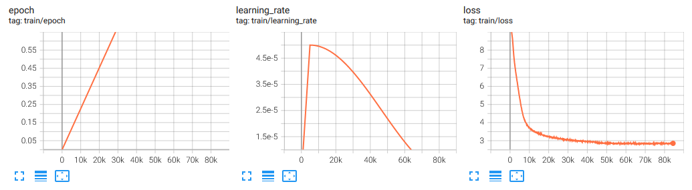
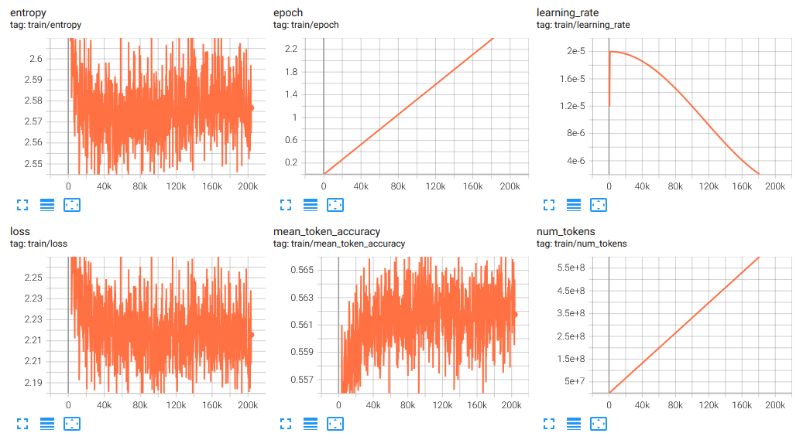

# Note-for-LLM-Training
一个完整的 LLM 训练的基本流程笔记 (分词器 -> 预训练 -> SFT -> DPO -> GRPO)

## 项目简介
本项目展示了一个完整的 LLM 训练的基本流程 (分词器 -> 预训练 -> SFT -> DPO -> GRPO)<br>
参考自 [MiniMind](https://github.com/jingyaogong/minimind) 和 [from-minimind-to-more](https://github.com/Tongyun1/from-minimind-to-more/tree/main)<br>
将原生实现尽可能替换为 PyTorch & HuggingFace 已有的功能来实现, 进一步降低上手门槛
- 在 [MiniMind](https://github.com/jingyaogong/minimind), 并在基础上做了如下调整
  1. 将模型的 KV Cache 替换为了 HuggingFace 的实现方式
  2. 模型的定义尽可能使用 PyTorch 内置的功能来实现
  3. 模型的预训练采用 HuggingFace 的 [transformers](https://huggingface.co/docs/transformers/index) 库来实现
  4. SFT, DPO, GRPO 直接调用 HuggingFace 的 [trl](https://huggingface.co/docs/trl/index) 库来实现
- 模型注释部分参考了 [from-minimind-to-more](https://github.com/Tongyun1/from-minimind-to-more/tree/main)

## 环境准备
- 环境配置
    ```Shell
    # PyTorch (CUDA 12.8)
    pip install -U torch torchvision --index-url https://download.pytorch.org/whl/cu128
    # HuggingFace Transformers & Datasets & Training
    pip install -U transformers==4.57.6 datasets accelerate
    # HuggingFace TRL
    pip install -U trl math-verify
    # HuggingFace Download
    pip install -U huggingface_hub[hf_xet]
    # 8-bit optimizers & NF4/FP4 quantization
    pip install -U bitsandbytes
    # Reward Model: internlm/internlm2-1_8b-reward
    # https://huggingface.co/internlm/internlm2-1_8b-reward
    pip install -U einops sentencepiece
    # Log
    pip install -U loguru
    # Others
    pip install -U torchinfo
    pip install -U tensorboard
    ```
- 奖励模型
  - 采用 [MiniMind](https://github.com/jingyaogong/minimind) 中使用的 [
internlm2-1_8b-reward](https://huggingface.co/internlm/internlm2-1_8b-reward)
- 数据集
  - 采用 [MiniMind](https://github.com/jingyaogong/minimind) 中所使用的 [数据集](https://www.modelscope.cn/datasets/gongjy/minimind_dataset/files) 来进行训练
  - `pretrain_hq.jsonl` 用于预训练
  - `sft_mini_512.jsonl` 用于 SFT (Supervised Fine-Tuning)
  - `dpo.jsonl` 用于 DPO (Direct Preference Optimization)
  - `rlaif-mini.jsonl` 用于 GRPO (Group Relative Policy Optimization)

## 训练流程
1. 执行 `trainer/train_tokenizer.py` 来训练分词器
   - 默认读取 `dataset/pretrain_hq.jsonl` 文件来创建分词
   - 对话模板会加载 `trainer/chat_template.jinja`
   - 训练完毕后, 会在 `model/train_tokenizer` 下生成分词配置文件
   - 请将这些文件复制到 `model/` 下, 后续加载的 *模型* 和 *分词器* 均在此目录下


2. 执行 `trainer/train_pretrain.py` 来进行预训练
   - 默认读取 `dataset/pretrain_hq.jsonl` 文件来进行预训练
   - 训练过程中的 `checkpoint` 会保存在 `training/PreTraining` 目录下
   - 训练过程中会生成 `training/PreTraining/runs` 文件夹, 可以在此处执行 `tensorboard --logdir .` 来查看训练情况


3. 执行 `trainer/train_sft.py` 来进行 SFT
   - 默认读取 `dataset/sft_mini_512.jsonl` 文件来进行训练
   - 默认读取 `training/PreTraining` 中最后一个 `checkpoint` 来进行训练
   - 训练过程中的 `checkpoint` 会保存在 `training/SFT` 目录下
   - 训练过程中会生成 `training/SFT/runs` 文件夹, 可以在此处执行 `tensorboard --logdir .` 来查看训练情况


4. [可选] 执行 `trainer/train_dpo.py` 来进行 DPO
   - 默认读取 `dataset/dpo.jsonl` 文件来进行训练
   - 默认读取 `training/SFT` 中最后一个 `checkpoint` 来进行训练
   - 训练过程中的 `checkpoint` 会保存在 `training/DPO` 目录下
   - 训练过程中会生成 `training/DPO/runs` 文件夹, 可以在此处执行 `tensorboard --logdir .` 来查看训练情况


5. [可选] 执行 `trainer/train_grpo.py` 来进行 GRPO
   - 默认读取 `dataset/rlaif-mini.jsonl` 文件来进行训练
   - 默认读取 `training/DPO` 中最后一个 `checkpoint` 来进行训练
   - 需要一个奖励模型, 默认读取自 `model/internlm2-1_8b-reward`
   - 训练过程中的 `checkpoint` 会保存在 `training/GRPO` 目录下
   - 训练过程中会生成 `training/GRPO/runs` 文件夹, 可以在此处执行 `tensorboard --logdir .` 来查看训练情况
   
   注意: 该脚本在 Windows 上执行会报 `OSError: [WinError 6] (invalid handle) during multiprocessing spawn` 的错误
    - 根据提交的 [issue](https://github.com/huggingface/trl/issues/5113) 结果, 明确告知 [trl](https://huggingface.co/docs/trl/index) 不支持 Windows
    - 因此如果想执行训练, 需要在 WSL2 中来执行训练
    - 驱动安装方法如下: [cuda-toolkit](https://developer.nvidia.com/cuda-downloads?target_os=Linux&target_arch=x86_64&Distribution=WSL-Ubuntu&target_version=2.0&target_type=deb_local)
        ```shell
        # CUDA 13.1: Download Installer for Linux WSL-Ubuntu 2.0 x86_64
        wget https://developer.download.nvidia.com/compute/cuda/repos/wsl-ubuntu/x86_64/cuda-wsl-ubuntu.pin
        sudo mv cuda-wsl-ubuntu.pin /etc/apt/preferences.d/cuda-repository-pin-600
        wget https://developer.download.nvidia.com/compute/cuda/13.1.1/local_installers/cuda-repo-wsl-ubuntu-13-1-local_13.1.1-1_amd64.deb
        sudo dpkg -i cuda-repo-wsl-ubuntu-13-1-local_13.1.1-1_amd64.deb
        sudo cp /var/cuda-repo-wsl-ubuntu-13-1-local/cuda-*-keyring.gpg /usr/share/keyrings/
        sudo apt-get update
        sudo apt-get -y install cuda-toolkit-13-1
        ```
      
## 效果测试
执行 `scripts` 中的 `test_chat.py` 和 `test_chat_with_template.py` 都可以, 其中 `test_chat_with_template.py` 是带有聊天模板的

## 实际效果
- 使用 transformers 进行对话
    
- 训练效果 - 预训练
  - 
- 训练效果 - SFT
  - 